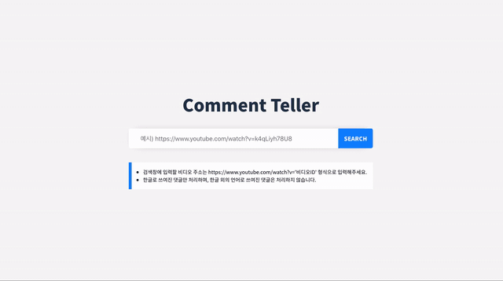

# 🤖 Comment Teller

  
유튜브 비디오의 댓글 중 가장 많이 나온 단어들을 워드클라우드로 보여줍니다!

* 비디오 주소는 예시와 동일하게 작성해주셔야 검색할 수 있습니다.
* 한글 이외의 언어는 처리하지 않습니다.(이모티콘, 숫자, 특수문자 ㅠㅠ, ㅋㅋ, ㅎㅎ 등 포함)
* 댓글에서 추출된 명사 중 최다 빈도의 단어 100개만 워드 클라우드로 생성됩니다.

## 기술 스택

### Client
* JS
* React
* React-redux
* Redux-thunk
* SCSS

### Server
* Node.js
* Express
* mecab-ya / mecab ko(형태소분석 라이브러리)
* Youtube API

